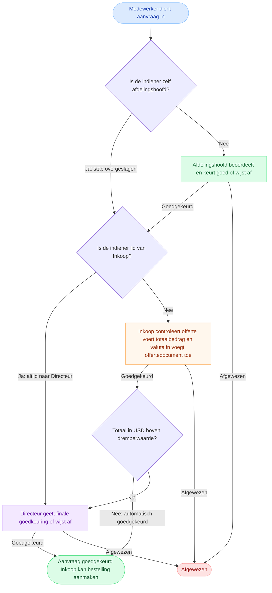
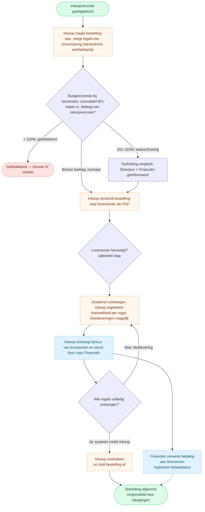

# Havenbeheer — Inkoop: Procesoverzicht

*Validatiesessie · Alle weergegeven stappen en regels zijn aannames ter bevestiging*

---

## Deel 1 — Inkoopverzoek (IV): goedkeuringscyclus

### Kortere routes en uitzonderingen

| Situatie | Wat er gebeurt |
|---|---|
| Indiener is zelf het afdelingshoofd | Stap "Afdelingshoofd" overgeslagen → direct naar Inkoop |
| Indiener is lid van de Inkoopsdienst | Stap "Inkoop" overgeslagen → altijd naar Directeur, ongeacht bedrag |
| Indiener is hoofd van de Inkoopsdienst | Beide stappen overgeslagen → direct naar Directeur |
| IV doorbelast aan goedgekeurd project én past binnen resterend budget | ⚠ Directeurstap overgeslagen, ook boven drempelwaarde — **ter bevestiging** |

### Wanneer mag de indiener annuleren?

| Status van het verzoek | Annuleren toegestaan? |
|---|---|
| Concept | ✓ Ja |
| Wacht op afdelingshoofd | ✓ Ja |
| Teruggestuurd door afdelingshoofd of Inkoop | ✓ Ja |
| Teruggestuurd door Directeur | ✗ Nee — Inkoop heeft al goedgekeurd |
| Bij Inkoop of Directeur ter beoordeling | ✗ Nee |
| Goedgekeurd / afgewezen / geannuleerd | ✗ Nee — definitief afgesloten |

---

## Deel 2 — Bestelling (BO): uitvoeringscyclus

### Statuswaarden bestelling

| Status | Betekenis |
|---|---|
| `concept` | Aangemaakt, nog niet verzonden |
| `verzonden` | Verstuurd naar leverancier |
| `bevestigd` | Leverancier heeft bevestigd (optioneel) |
| `gedeeltelijk_ontvangen` | Minimaal één regel deels ontvangen |
| `ontvangen` | Alle regels volledig ontvangen — nog af te sluiten |
| `afgerond` | Inkoop heeft afgesloten — vergrendeld |
| `gesloten` | Afgesloten met reden — vergrendeld |
| `geannuleerd` | Ingetrokken vóór verzending |

---

## Diagrammen aanpassen

De diagrammen zijn geschreven in **Mermaid**. U kunt ze live bewerken op [mermaid.live](https://mermaid.live) — plak de code van een diagram, pas aan en kopieer terug.

Basisnotatie:

| Syntax | Betekenis |
|---|---|
| `[Tekst]` | Stap (rechthoek) |
| `{Tekst}` | Beslissing (ruit) |
| `([Tekst])` | Begin- of eindpunt (ovaal) |
| `A --> B` | Pijl van A naar B |
| `A -- Label --> B` | Pijl met label |
| `A -. Label .-> B` | Gestippelde pijl |
| `style X fill:#kleur,stroke:#rand` | Kleur van een knoop aanpassen |
